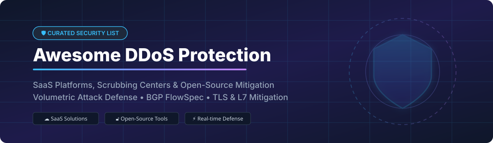

  

# 🛡️ Awesome DDoS Protection Service

  
  
  
  
  

**Curated List of Enterprise SaaS Platforms & Open-Source GitHub Projects for DDoS Mitigation**

*Focused on Volumetric Attack Mitigation, Global Scrubbing Centers, BGP FlowSpec, TLS Handshake Defense & On-Premises Security Infrastructure.*

**Last updated: October 2026**

---

## 📖 Table of Contents

- [☁️ SaaS/Hosted Platforms](#️-saashosted-platforms)
- [🔓 Open-Source GitHub Projects](#-open-source-github-projects)
- [🤝 How to Contribute](#-how-to-contribute)
- [💖 Support & Sponsorship](#-support--sponsorship)
- [📈 Star History](#-star-history)
- [⚠️ Disclaimer](#️-disclaimer)

---

## ☁️ SaaS/Hosted Platforms

> **📊 Market Size & Industry Structure**: The global DDoS protection market is estimated at **~$5.5 Billion in 2026**, projected to grow at a CAGR of 14.2% toward **~$12 Billion by 2032**. The sector is **moderately concentrated** with leading cloud providers (AWS, Microsoft, Cloudflare, Akamai) capturing significant market share for edge & scrubbing defenses, while specialized security providers serve specific enterprise and telecom niches. No single vendor holds a winner-take-all monopoly, making multi-cloud and hybrid DDoS defenses standard across global enterprise infrastructure.

Below is a comparison of top SaaS DDoS protection products, sorted by company size/revenue (descending):

| Platform | Description | Pricing (Starting Tier) | Free Tier / Trial Limits | Company Size / Valuation |
| :--- | :--- | :--- | :--- | :--- |
| **[AWS Shield](https://aws.amazon.com/shield/)** 🛡️ | **AWS-native DDoS protection.** Standard provides automatic L3/L4 defense; Advanced adds L7 defense, DRT support, cost protection, and bundled WAF. | **Standard**: $0/mo (Free for AWS resources); **Advanced**: $3,000/month per org + usage data fees | **Standard**: Free for life for all AWS CloudFront, Route 53, Global Accelerator, and ELB resources | **~$638B Revenue** (Amazon FY2025) |
| **[Azure DDoS Protection](https://azure.microsoft.com/en-us/services/ddos-protection/)** ☁️ | **Azure-native network security.** Network Protection covers full VNets; IP Protection secures individual public IP endpoints with rapid mitigation. | **IP Protection**: $199/month per public IP; **Network Protection**: $2,944/month (covers up to 100 IP resources) | **30-day Free Trial** ($200 Azure free credit applicable to testing) | **~$281B Revenue** (Microsoft FY2025) |
| **[Akamai Prolexic](https://www.akamai.com/products/prolexic-solutions)** 🌐 | **Enterprise BGP scrubbing network.** 20+ Tbps dedicated scrubbing capacity across 36 global scrubbing centers with zero-second SLA options. | **Routed (Always-On)**: Starts at $5,000/month; **On-Demand**: Starts at $7,500/month setup + recurring retainer | **Free POC / Enterprise Demo** available (Requires company ASN & minimum /24 IPv4 prefix) | **~$4.0B Revenue** (Akamai FY2025) |
| **[F5 Distributed Cloud DDoS](https://www.f5.com/products/distributed-cloud-services)** ⚡ | **Cloud-delivered application delivery & DDoS mitigation.** High-capacity scrubbing for multi-cloud app deployments. | **DDoS Mitigation Tunnel Add-on**: Starts at $129.99/month (CDW list price per app tunnel) | **2 Free DDoS simulation tests/year** for subscribers; 1 free POC trial run | **~$2.8B Revenue** (F5 Inc. FY2025) |
| **[Cloudflare DDoS Protection](https://www.cloudflare.com/ddos/)** 🚀 | **Global edge DDoS defense.** Unmetered L3/L4/L7 mitigation across 330+ cities worldwide with automated threat intelligence. | **Free**: $0/month; **Pro**: $20/month; **Business**: $200/month; **Enterprise**: Custom quotes | **Free Tier**: Unlimited & unmetered DDoS mitigation forever for unmetered web traffic | **~$2.17B Revenue** (Cloudflare FY2025) |
| **[Fastly DDoS Protection](https://www.fastly.com/products/ddos-protection)** ⏩ | **Programmable edge DDoS defense.** Real-time visibility and automatic scrubbing that excludes attack traffic from billing meter. | **Usage-based**: $1.00 per 10k requests (0.5M–10M volume tier; drops to $0.10 per 10k at high volume) | **First 500,000 requests/month free** for DDoS Protection add-on | **~$624M Revenue** (Fastly FY2025) |
| **[Link11](https://www.link11.com/)** 🏰 | **AI-driven European DDoS protection.** Sub-10-second automatic time-to-mitigate (TTM) for web apps, DNS, and IP infrastructure. | **Cloud Protection**: Starts at $1,200/month (based on protected bandwidth tier) | **14-day Enterprise Trial** upon security team evaluation | **Private ($50M–$100M est.)** |
| **[Flowtriq](https://flowtriq.com/)** 🎯 | **Real-time DDoS detection & auto-mitigation.** Designed for hosting providers, ISPs, and game server networks with sub-second detection. | **Starter Plan**: Starts at $299/month for standalone server agents & network monitoring | **14-day Free Trial** (Full platform access, no credit card required) | **Private (Bootstrapped/Seed)** |

---

## 🔓 Open-Source GitHub Projects

Below is a list of top open-source DDoS protection tools, firewalls, and WAF mitigation software sorted by GitHub Star Count (descending):

| Repo & Description | Star Count |
| :--- | :--- |
| **[CrowdSec](https://github.com/crowdsecurity/crowdsec)** 🤝 Collaborative, open-source & cloud-connected IPS/IDS with AppSec WAF engine. Analyzes behavior to block volumetric abuse, SQLi, and botnets across Nginx, Caddy, HAProxy, and Traefik. (MIT License) |  |
| **[ModSecurity](https://github.com/SpiderLabs/ModSecurity)** 🧱 The classic, battle-tested open-source Web Application Firewall engine. Supports layer 7 attack filtering for Apache, Nginx, and IIS. (Apache-2.0 License) |  |
| **[BunkerWeb](https://github.com/bunkerity/bunkerweb)** 🏰 Open-source WAF/WAAP with anti-DDoS at the TLS layer. Drops malicious flood connections before the TLS handshake completes, reducing server CPU utilization by over 50% under heavy attacks. (AGPL-3.0 License) |  |
| **[Coraza WAF](https://github.com/corazawaf/coraza)** ⚡ Enterprise-grade, high-performance open-source WAF library written in Go. Drop-in replacement for ModSecurity with native support for OWASP Core Rule Set (CRS). (Apache-2.0 License) |  |
| **[FastNetMon](https://github.com/pavel-odintsov/fastnetmon)** 📊 Very fast DDoS detection engine written in C++. Analyzes NetFlow, sFlow, IPFIX, and SPAN/mirror port traffic to detect volumetric floods in milliseconds and trigger RTBH/BGP FlowSpec. (GPL-2.0 License) |  |
| **[HAProxy](https://github.com/haproxy/haproxy)** 🔀 The Reliable, High Performance TCP/HTTP Load Balancer. Widely used for rate-limiting, stick-table connection tracking, and L4/L7 DDoS mitigation at scale. (GPL-2.0 License) |  |
| **[OpenResty](https://github.com/openresty/openresty)** 🌙 Full-fledged web platform combining Nginx and LuaJIT. Core component for building custom low-latency DDoS rate limiters and dynamic IP blocking layers. (BSD-2-Clause License) |  |
| **[ftagent (Flowtriq)](https://github.com/flowtriq/ftagent)** ⚡ Real-time DDoS detection, attack classification, PCAP forensics, and auto-mitigation agent for Linux. Detects attacks in under 1 second and mitigates via eBPF/XDP, iptables, or BGP FlowSpec. (AGPL-3.0 License) |  |
| **[GÉANT FoD (Firewall on Demand)](https://github.com/GEANT/FOD)** 🛰️ Production-grade, multi-tenant DDoS mitigation platform based on BGP FlowSpec. Used by European research & education networks (NRENs) for over 8 years. (BSD-2-Clause License) |  |
| **[RARE (Router for Academia, Research & Education)](https://github.com/GEANT/RARE)** 🔬 Programmable data plane (P4, XDP, DPDK) for high-speed hardware-accelerated DDoS filtering in campus and research networks. (GPL-3.0 License) |  |

---

## 🤝 How to Contribute

Contributions are warmly welcome! Help make this curated security list better for network engineers and SOC analysts worldwide:

1. 🍴 **Fork** the repository.
2. 📝 **Add/Update** entries in `README.md` following the tabular format.
3. 🔍 Ensure pricing data, company figures, and free tier limits are factual and verified.
4. 🚀 **Submit a Pull Request** with a clear explanation of your changes.

Check out our [Awesome-Awesome-Awesome](https://github.com/ishandutta2007/Awesome-Awesome-Awesome) meta-list for more awesome developer resources!

---

## 💖 Support & Sponsorship

If you found this DDoS protection guide helpful, please consider supporting the project:

- ⭐ **Star** this repository to increase its visibility.
- 🔄 **Share** it with your network security & DevOps teams.
- ☕ **Sponsor / Buy me a coffee**: Your support helps maintain open-source security lists!
  
👉 **[Sponsor on GitHub Sponsors](https://github.com/sponsors/ishandutta2007)** ❤️

---

## 📈 Star History

---

## ⚠️ Disclaimer

- This is a **community-curated** educational reference list and does not constitute commercial endorsement.
- DDoS protection platforms process critical production traffic; always test mitigation rules in staging environments before enabling blocking mode.
- **Pricing & Tier Caveat**: All pricing estimates and revenue figures are based on publicly verified records as of October 2026. Vendor terms change periodically; consult official vendor portals for binding quotes.

---

Made with ❤️ for network engineers, security architects, and infrastructure teams.

